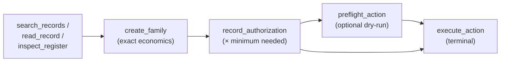
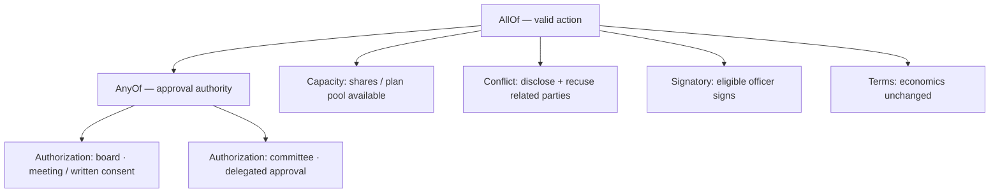

# prime-legal-envs

**Verifiable reinforcement-learning environments for corporate law and governance — deterministic reward, no LLM judge, fully synthetic worlds.**


-6f42c1)


---

## Overview

`prime-legal-envs` is a home for **verifiable legal / corporate-governance environments** in Prime Intellect's
[`verifiers`](https://github.com/PrimeIntellect-ai/verifiers) `v1` format. It currently ships **one** environment:

> **`valid_action`** — a multi-turn, tool-use environment in which an agent must complete one synthetic
> corporate action (a contract, an equity grant, a security issuance, a related-party transaction, a
> token-treasury sale, or a subsidiary financing) *end to end* — reading fictional corporate records,
> identifying the operative approval rules, and executing the action through state-changing tool calls
> under a typed AND/OR requirement graph.

**Who it's for**

- **RL practitioners** who want a hard, multi-step, tool-use task with a *cheap and reproducible* reward
  signal — no judge model, no API cost, no rubric drift.
- **Legal-tech / governance folks** who want to probe whether a model actually understands *process*
  (who has to approve what, in what order, with what disclosures) rather than just producing fluent prose.

**Why a deterministic, oracle-backed legal environment is interesting for RLVR**

Most "LLM-as-agent-for-law" evaluations lean on a judge model, which is expensive, non-reproducible, and
itself game-able. `valid_action` takes the opposite approach:

- The reward is a **pure function** of the agent's tool calls against a hand-authored, typed rule graph.
- The optimum is computed by a **deterministic dynamic-programming oracle**, so the environment always
  knows the *minimum valid process cost* and can score efficiency, not just success.
- Success requires **state changes** (create → authorize → execute). Prose changes nothing and earns nothing,
  which closes the most common reward-hacking channel by construction.

Everything in the world is **fictional**. The jurisdiction ("Northstar"), companies, people, and documents
are procedurally generated. There is **no client data and no real legal advice** anywhere in this repo.

---

## At a glance

| | |
|---|---|
| Environments shipped | 1 (`valid_action`; env id `valid-action`) |
| Format | Prime Intellect `verifiers` v1 (`load_environment` / `load_taskset`) |
| Task | Multi-turn tool use, 10 / 14 / 18 turns (easy / medium / hard) |
| Action families | 6 (contract, equity grant, security issuance, related-party txn, token sale, subsidiary financing) |
| World templates | 9 hand-authored golden templates (G1–G9), procedurally re-seeded |
| Reward | `min(1.0, oracle_min_cost / actual_cost)`, `0.0` on any invalid/missing step — **no LLM judge** |
| Oracle | Deterministic DP over a typed AND/OR requirement graph |
| Tests | **103 passing**, all offline & deterministic (`~3 s`) |
| Baselines | 5 deterministic policies (random → oracle-replay) |
| Dependencies | `verifiers>=0.1.14`, `pydantic>=2.6` |

---

## Featured environment: `valid_action`

### What the agent does

The agent plays **corporate counsel**. It is handed one business request — e.g. *"grant 42,000 RSUs to this
employee, effective 2028-09-15, without changing the economics"* — and a hidden world of fictional records
and registers. It must:

1. **Read** the records and registers to find the operative authority, capacity, conflicts, consents,
   ordering, and eligible signatory.
2. **Create** the action with the *exact* requested economics (any mismatch is rejected — nothing is created).
3. **Authorize** it with *only* the approval and consent steps a valid path actually requires.
4. **Execute** it through the terminal tool with an eligible signatory.

Execution is **irreversible** and ends the rollout. Explanations and draft prose do not change the world and
receive no credit.



### The world (fully synthetic)

The hidden state is a `ValidActionWorld` (a strict Pydantic v2 model). It holds an entity (and optional
subsidiary), people, dated role appointments (directors / officers / committee members), governance bodies,
security classes and cap-table positions, equity-plan capacity, dated legal records (bylaws, committee
charters, delegation matrices, equity plans, investor agreements, debt instruments, prior resolutions,
conflict disclosures, …), a **typed requirement graph**, one action request, and the pre-computed oracle
solution. The agent-visible projection **strips the hidden `source_rule_ids`** and never reveals the
requirement graph or the oracle path.

Records are **deterministic prose projections** of the structured rules — the renderer expands section stubs
into synthetic legal wording (15 clause templates, 33 wording variants) so the same rule reads differently
across worlds. Legal text is data, not instructions.

### Tools

Tools are grouped into three toolsets. In any single rollout the agent sees **7 tools**: the three read
tools, the three authorization/terminal tools, and **exactly one** `create_<family>` tool selected to match
the task (the other five create variants are hidden). The full pool is **12 tool functions**.

| Toolset | Tool | What it does |
|---|---|---|
| Read (always visible) | `search_records(query, entity_id?, record_type?)` | Deterministic pure-Python **BM25** over rendered record prose |
| | `read_record(record_id)` | Returns record sections with hidden `source_rule_ids` stripped |
| | `inspect_register(entity_id, register_type, as_of_date)` | Directors / officers / committee / cap table / security capacity / plan capacity / subsidiaries, as of a date |
| Authorize (always visible) | `record_authorization(action_id, authorizer_id, method, participant_ids, recused_ids?, disclosure_record_ids?)` | Records one vote or consent step; validated immediately |
| | `preflight_action(action_id)` | Deterministic dry-run of the full requirement graph; consumes one preflight credit |
| | `execute_action(action_id, signatory_person_id)` | **Terminal & irreversible** — validates the whole path and ends the rollout |
| Create (one shown per task) | `create_material_contract` · `create_equity_grant` · `create_security_issuance` · `create_related_party_transaction` · `create_token_treasury_transaction` · `create_subsidiary_financing` | Drafts the action; rejects anything whose economics don't match the request |

Every tool returns a JSON envelope with `remaining_turns`, `preflight_checks_remaining`, `action_status`, and
`terminal`, so the agent always knows its budget.

### The rule graph

Each world carries a `RequirementGraph`: an **AND/OR tree** of typed nodes. `AllOf` requires every child;
`AnyOf` is satisfied by the cheapest valid child. Atomic nodes carry the actual rule parameters:

| Node type | Encodes |
|---|---|
| `AuthorizationRequirement` | Which body must approve, by which methods, with which quorum & vote thresholds |
| `ConsentRequirement` | Counterparty / security-class / third-party consent |
| `CapacityRequirement` | Authorized-share headroom, equity-plan pool, treasury tokens, borrowing headroom |
| `ConflictRequirement` | Related-party disclosure + recusal + special-approval routing |
| `SequenceRequirement` | Ordering constraints between steps |
| `SignatoryRequirement` | Who may sign (eligible roles / titles / commitment caps / entity) |
| `TermsRequirement` | The created economics must match the request (`ge` / `le` / `eq` comparisons) |
| `ProhibitionRequirement` | Hard blocks (e.g. treasury-floor breach) |



*(Illustrative shape; the real graph per world is generated and hidden from the agent.)*

### The reward

A single reward, `final_validity_efficiency`:

```text
reward = 0.0                                    if no execution, or execution invalid, or any required step missing
reward = min(1.0, oracle_min_cost / actual)     otherwise
```

- `oracle_min_cost` is the **minimum number of authorization steps** on a valid path, computed by the DP oracle.
- `actual` is the number of authorization attempts the agent recorded (`max(1, …)`), so **redundant or failed
  authorizations lower the reward even when the final action is valid**. Doing the right thing *efficiently*
  is what scores 1.0.

Alongside the reward, the environment emits **8 metrics** for analysis: `execution_attempted`,
`execution_valid`, `process_cost`, `process_efficiency_ratio`, `turns_used`, `tool_error_count`,
`preflight_used`, and `validation_defects`. The validator reports **all** discoverable defects (22 typed
defect codes such as `no_quorum`, `missing_recusal`, `conflicted_vote_counted`, `wrong_authorizer`,
`terms_mismatch`, `invalid_signatory`), not just the first.

### Example trajectory

An employee-RSU (family `G3`) world, solved on the minimal path:

```text
turn 1: search_records(query="committee", entity_id="ent_lumen")
turn 2: read_record(record_id="rec_bylaws_g3")
turn 3: inspect_register(entity_id="ent_lumen", register_type="directors", as_of_date="2028-09-15")
turn 4: create_equity_grant(entity_id="ent_lumen", recipient_person_id="prs_maya_g3",
          award_type="rsu", units=42000, vesting_months=48, cliff_months=12,
          effective_date="2028-09-15")
turn 5: record_authorization(action_id="act_...", authorizer_id="body_comp_g3",
          method="meeting", participant_ids=["role_comp_a_g3", "role_comp_b_g3"])
turn 6: execute_action(action_id="act_...", signatory_person_id="prs_ceo_g3")
→ score: 1.0   (oracle_min_cost = 1, actual = 1)
```

The IDs above are readable, fixture-level placeholders for clarity. **Generated** worlds use salted-hash IDs
(e.g. `ent_cbf2ea2a`, `body_d1c723b1`, `role_6bbe0aee`) so every seeded instance is disjoint; you can print a
real generated world and its oracle path with the snippet in [Reproducibility](#reproducibility).

---

## Why the reward is hard to game

The environment is designed so that the usual reward-hacking channels are closed *structurally*, not by a
watchful judge:

- **Prose earns nothing.** Only tool calls change state; a fluent "I hereby approve…" scores `0.0`.
- **Economics are locked.** `create_<family>` rejects any payload that doesn't match the request, so an agent
  can't quietly change the deal to make approval easier.
- **The oracle is the yardstick.** Because the *minimum* valid process is known exactly, over-authorizing
  ("approve with every body just in case") is penalized through `actual > oracle`, and under-authorizing fails
  validation outright.
- **All defects are checked.** Wrong authorizer, wrong method, no quorum, uncounted-conflicted-vote, missing
  recusal, missing consent, stale/superseded authority, ineligible or wrong-entity signatory, capacity
  overruns, and terms mismatches each zero the reward.

This is exercised by **5 deterministic baselines** and a dedicated **13-test reward-hacking suite**
(`tests/test_reward_hacking.py`), which confirms — among other attacks — that prose-only scores 0, a fabricated
execution receipt scores 0, blanket stockholder approval cannot cure a missing board action, guessed IDs do
not satisfy anything, superseded delegations grant no authority, a wrong-entity signatory scores 0, a
double-execution is impossible, prompt-injection prose in records does not affect tool output, and calling
`preflight_action` does not inflate the reward.

---

## Quickstart

### Install (locally verified path)

```bash
git clone <this-repo> prime-legal-envs
cd prime-legal-envs/environments/valid_action

# core runtime (verifiers + pydantic)
pip install -e .
# add the dev extras (pytest, hypothesis, ruff) to run the suite
pip install -e '.[dev]'
```

### Run the offline baselines (reproducible, no model needed)

```bash
cd environments/valid_action
python scripts/baselines.py --examples 32 --difficulty medium --seed 17
```

### Run the test suite

```bash
cd environments/valid_action
python -m pytest tests/ -q      # -> 103 passed
```

### Evaluate a model (standard Prime / verifiers invocation)

This requires a model endpoint / API key and network access (not exercised by the offline checks above):

```bash
# via the Prime CLI
prime eval run valid-action -m openai/gpt-4.1-mini -n 4 -r 1
```

The environment is also loadable directly through its public API:

```python
import valid_action
env = valid_action.load_environment()   # returns a verifiers Env
```

### Environment arguments

| Arg | Type | Default | Effect |
|---|---|---|---|
| `difficulty` | `easy` \| `medium` \| `hard` | `medium` | Sets `max_turns` (10 / 14 / 18) and distractor-record count (0 / 2 / 4) |
| `seed` | int | `17` | Master seed; train and eval draw **disjoint** seeds from it |
| `num_train` | int | `64` | Train rows |
| `num_eval` | int | `32` | Eval rows |
| `preflight_budget` | int | `1` | `preflight_action` calls allowed per rollout |
| `max_search_results` | int | `5` | Per-call cap on `search_records` results |
| `include_distractors` | bool | `true` | Inject distractor records |
| `system_prompt` | object \| null | `null` | Override the default agent prompt |
| `max_turns_override` | int \| null | `null` | Force a specific `max_turns` |

---

## Baselines

Five deterministic policies ship in `scripts/baselines.py`. Numbers below are **reproduced locally**
(`--examples 32 --difficulty medium --seed 17`, `verifiers 0.1.14`, `pydantic 2.13.4`, Python 3.11):

| Baseline | Mean reward | Valid rate | What it shows |
|---|---|---|---|
| `random` | **0.000** | 0.00 | Random tool calls never accidentally score |
| `naive_max_approval` | **0.188** | 0.19 | Always approving with the largest body only clears the ~19% of worlds where a single meeting suffices |
| `keyword_heuristic` | **0.188** | 0.19 | Family-keyword body-picking is no better than naive |
| `oracle_replay` | **1.000** | 1.00 | Every world is solvable with reward 1.0 (upper bound) |
| `search_only` | **0.000** | 0.00 | Reading records without acting scores 0 |

The spread between `oracle_replay` (1.0) and the naive heuristics (~0.19) is the headroom an RL policy has to
climb. `random` and `search_only` at 0.0 confirm the reward can't be reached by prose-only or tool-error-only
paths. *(The same table holds at `easy` and `hard` — difficulty changes turn budget and distractor volume, not
the underlying validity of these fixed policies.)*

---

## Testing

All tests are **offline and deterministic** (no network, no model):

```bash
cd environments/valid_action
python -m pytest tests/ -q      # -> 103 passed in ~3s
```

The suite spans world construction, tools, rendering & search, scoring, property/round-trip invariants
(`hypothesis`), the environment wiring, and the reward-hacking matrix:

| File | Focus |
|---|---|
| `tests/test_world_checkpoint.py` | World models, IDs, cross-references, oracle feasibility |
| `tests/test_tools.py` | Tool behaviour, envelopes, error paths |
| `tests/test_render_and_search.py` | Deterministic rendering + BM25 search |
| `tests/test_scoring.py` | Reward / efficiency computation |
| `tests/test_property.py` | Property & JSON round-trip invariants |
| `tests/test_environment.py` | Taskset wiring, toolsets, reward/metric/stop hooks |
| `tests/test_reward_hacking.py` | 13 anti-gaming attacks, all forced to score 0 or < 1 |

---

## Repository layout

```text
prime-legal-envs/
├── README.md                     # (this file)
└── environments/
    └── valid_action/
        ├── README.md             # environment-level reference
        ├── pyproject.toml        # package + verifiers eval config
        ├── config/
        │   └── system_prompt.txt # default agent prompt
        ├── scripts/
        │   └── baselines.py      # 5 deterministic baseline policies
        ├── valid_action/
        │   ├── valid_action.py   # Prime taskset wiring: config, tools, reward, metrics, stop
        │   └── core/
        │       ├── models.py         # Pydantic domain models + enums
        │       ├── requirements.py   # typed AND/OR requirement graph
        │       ├── fixtures.py       # 9 golden world templates (G1–G9)
        │       ├── generator.py      # seeded, oracle-verified world generation
        │       ├── render.py         # deterministic legal-prose renderer
        │       ├── search.py         # pure-Python BM25 index
        │       ├── oracle.py         # minimum-valid-process DP oracle
        │       ├── validator.py      # full-execution validator (all defects)
        │       ├── scoring.py        # reward = min(1, oracle/actual)
        │       └── serialization.py  # canonical JSON + structural fingerprint
        └── tests/                # 103 offline tests
```

### Adding a new environment

The layout is deliberately one-directory-per-environment so the repo can grow:

1. Create `environments/<your_env>/` with its own `pyproject.toml` (declare `verifiers>=0.1.14`) and a
   package exposing `load_environment` (see `valid_action/valid_action.py` for the reference wiring:
   `TasksetConfig` subclass → `load_taskset` → tools + one reward + metrics + one stop).
2. Keep the **reward deterministic** and, ideally, back it with an **oracle** so you can ship baselines that
   bracket the achievable range (a `random` floor and an `oracle_replay` ceiling).
3. Add an offline `pytest` suite — including a **reward-hacking** file — and a `scripts/baselines.py`.
4. Document the environment in its own `README.md` and add a row to the table at the top of this file.

---

## Limitations & scope

Stated plainly, so nothing here is over-read:

- **Fully synthetic and fictional.** The "Northstar" jurisdiction, entities, people, and documents are
  procedurally generated. This is **not legal advice** and reflects **no client or proprietary data**.
- **Private-company scope.** The six action families model US-style *private-company* governance. Public-company
  regimes (SEC filings, 14A disclosures, NYSE/Nasdaq listing standards) are **out of scope**.
- **Template-driven prose.** Records are generated from a fixed set of clause templates and wording variants;
  real-world documents vary far more than this.
- **Single action per rollout.** Each world contains exactly one action to complete; multi-action sequencing
  across roles is not modeled.
- **Oracle scope.** The oracle is a DP over a typed AND/OR graph. It computes minimum valid *process cost*; it
  does not simulate negotiation, amendment, or post-execution events.
- **Worlds come from 9 golden templates (G1–G9), re-seeded.** Structure is varied by salted re-tagging and
  distractor injection rather than by open-ended compositional generation.

---

## Reproducibility

All randomness is seeded, and the generator runs each world through the oracle *and* re-validates the oracle's
own replay before accepting it, so generated worlds are solvable by construction. To reproduce the eval set and
its baselines:

```bash
cd environments/valid_action
python -m pytest tests/ -q                                      # 103 passed, all offline
python scripts/baselines.py --examples 32 --difficulty medium --seed 17
```

To print a real generated world and its oracle path (as in the example above):

```python
from valid_action.core.generator import generate_dataset, split_seeds
from valid_action.core.models import Difficulty

seeds = split_seeds(17)
worlds = generate_dataset(split="eval", difficulty=Difficulty.MEDIUM, seed=seeds["eval"], num_examples=8)
w = next(x for x in worlds if x.world_template_id.startswith("G3"))
print(w.world_template_id, w.action_request.action_type.value, w.oracle_solution.minimum_process_cost)
for step in w.oracle_solution.authorization_steps:
    print(step.authorizer_id, step.method.value, step.participant_ids)
```

---

## License

MIT — see [`LICENSE`](LICENSE).

---

*See [`environments/valid_action/README.md`](environments/valid_action/README.md) for the full
environment-level reference, including the state model, per-defect metrics, and version history.*
